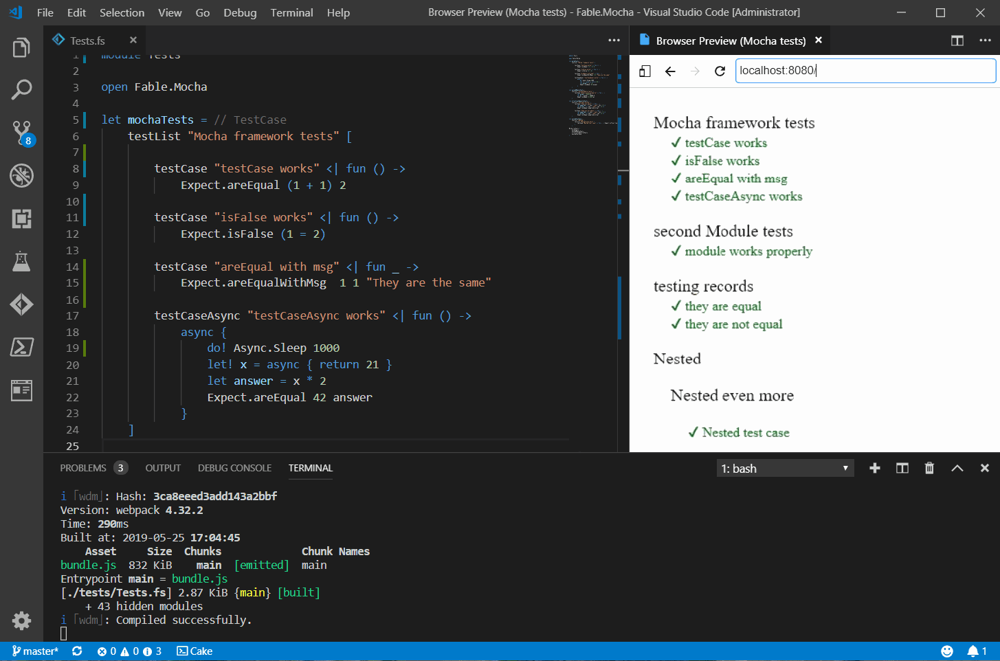

# Fable.Mocha [](https://www.nuget.org/packages/Fable.Mocha) [](https://ci.appveyor.com/project/Zaid-Ajaj/fable-mocha)


[Fable](https://github.com/fable-compiler/Fable) library for [Mocha](https://mochajs.org/), a javascript test runner and framework. The API is inspired by the popular [Expecto](https://github.com/haf/expecto) library for F# and adopts the `testList`, `testCase` and `testCaseAsync` primitives for defining tests. The tests can be run inside node.js using `mocha` or in the browser using the built-in test runner (0 dependencies).



## Installation
Install the Fable binding from Nuget
```bash
# using nuget
dotnet add package Fable.Mocha

# or with paket
paket add Fable.Mocha --project /path/to/project.fsproj
```

## Writing Tests
Assuming you have you the following project structure:
```
repo
 |
 |-- package.json
 |-- src
      | -- YourLibrary.fsproj
      | -- Library.fs
 |-- tests
      | -- Tests.fsproj
      | -- Tests.fs
```
Where `tests` contains the test project, you will install `Fable.Mocha` into the `Tests.fsproj` and it will look like this:
```xml
<Project Sdk="Microsoft.NET.Sdk">
  <PropertyGroup>
    <TargetFramework>netstandard2.0</TargetFramework>
  </PropertyGroup>
  <ItemGroup>
    <Compile Include="Tests.fs" />
  </ItemGroup>
  <ItemGroup>
    <ProjectReference Include="..\src\YourLibrary.fsproj" />
  </ItemGroup>
  <ItemGroup>
    <PackageReference Include="Fable.Mocha" Version="1.0.0" />
  </ItemGroup>
</Project>
```
then you can start writing your tests into the `Test.fs` file:
```fs
module Tests

open Fable.Mocha

let arithmeticTests =
    testList "Arithmetic tests" [

        testCase "plus works" <| fun () ->
            Expect.areEqual (1 + 1) 2

        testCase "Test for falsehood" <| fun () ->
            Expect.isFalse (1 = 2)

        testCaseAsync "Test async code" <| fun () ->
            async {
                let! x = async { return 21 }
                let answer = x * 2
                Expect.areEqual 42 answer
            }
    ]

Mocha.runTests [ arithmeticTests ]
```

## Running the tests using node.js

Install the actual `mocha` test runner from Npm along side `fable-splitter` that will compile your test project into a node.js application
```bash
npm install --save-dev mocha fable-splitter
```
Add the following `pretest` and `test` npm scripts to your `package.json` file:
```json
"pretest": "fable-splitter tests -o dist/tests --commonjs",
"test": "mocha dist/tests"
```
Now you can simply run `npm test` in your terminal and it will run the `pretest` script to compile the test project and afterwards the `test` script to actually run the (compiled) tests using mocha.

## Running the tests using the browser
Trying to use mocha to run tests in the browser will give you headaches as you have to include the compiled individual test files by yourself along with mocha specific dependencies. That's why Fable.Mocha includes a *built-in* test runner for the browser. You don't need to change anything in the existing code, it just works!

Compile your test project using default fable/webpack as follows.

First, install `fable-loader` along with with `webpack` if you haven't already:
```
npm install fable-loader webpack webpack-cli webpack-dev-server
```
Add an `index.html` page inside directory called `public` that contains:
```html
<!DOCTYPE html>
<html>
    <head>
        <title>Mocha tests</title>
    </head>
    <body>
        <script src="bundle.js"></script>
    </body>
</html>
```
Create a webpack config file that compiles your `Tests.fsproj`
```js
var path = require("path");

module.exports = {
    entry: "./tests/Tests.fsproj",
    output: {
        path: path.join(__dirname, "./public"),
        filename: "bundle.js",
    },
    devServer: {
        contentBase: "./public",
        port: 8080,
    },
    module: {
        rules: [{
            test: /\.fs(x|proj)?$/,
            use: "fable-loader"
        }]
    }
}
```

Now you can run your tests live using webpack-dev-server or compile the tests and run them by yourself. Add these scripts to your `package.json`
```
"start": "webpack-dev-server",
"build-for-browser": "webpack"
```
Now if you run `npm start` you can navigate to `http://localhost:8080` to see the results of your tests.

### Testing multiple modules
The function `Mocha.runTests` takes in a list of test modules. Each test module is created using the `testList` function so you can seperate your tests into these modules:
```fs
module Tests

open Fable.Mocha

let firstModuleTests =
    testList "firstModule" [
        testCase "module works properly" <| fun _ ->
            let answer = 21
            Expect.areEqual 42 (answer * 2)
    ]

let secondModuleTests =
    testList "secondModuleModule" [
        testCase "module works properly" <| fun _ ->
            let answer = 31415.0
            let pi = answer / 10000.0
            Expect.areEqual 3.1415 pi
    ]

// Tests can be nested too!
let nestedTests =
    testList "first level" [
        testList "second level" [
            testCase "my test code" <| fun _ -> ()
        ]
    ]

Mocha.runTests [ firstModuleTests; secondModuleTests; nestedTests ]
```